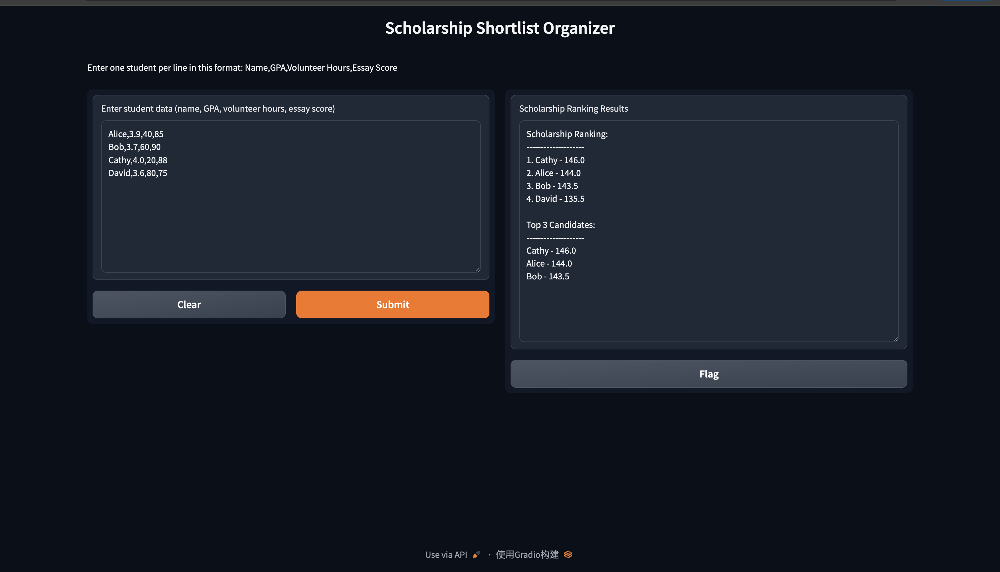
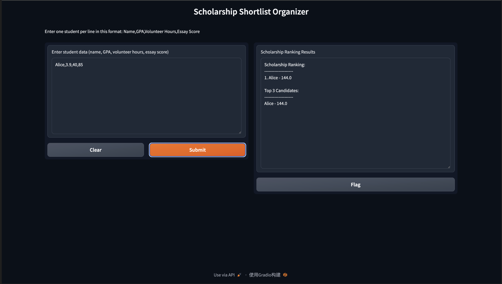
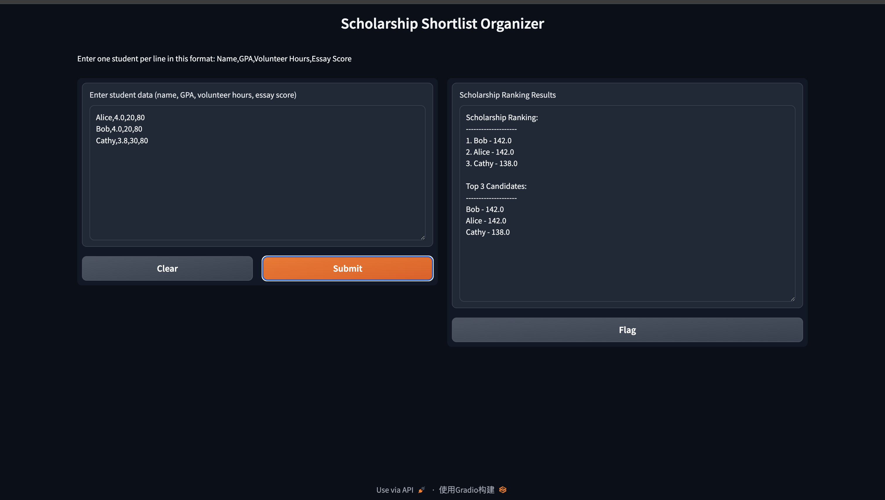
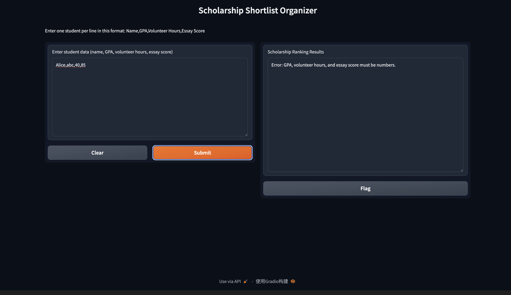

# Scholarship Shortlist Organizer

## Project Overview
This project is a small Python application for helping rank scholarship applicants based on their academic and extracurricular performance.

The program uses **Merge Sort** to sort students by their total scholarship score. The results are ranked from highest to lowest. It also displays the **Top 3 candidates** after sorting.

A simple **Gradio GUI** is used so users can enter student data, run the program, and view the ranking results in a visual way.

This project solves a realistic computing problem: organizing and ranking scholarship applicants fairly and efficiently.

## Computational Thinking

### 1. Decomposition
I broke the problem into smaller parts so it would be easier to build and test.

The program was divided into these main tasks:

1. reading student input data
2. converting the input into usable values
3. calculating each student's scholarship score
4. sorting students by score
5. displaying the full ranking and top 3 candidates
6. handling invalid input

### 2. Pattern Recognition
I noticed that each student follows the same data pattern:

- name
- GPA
- volunteer hours
- essay score

I could use the same formula and sorting process for all students, because every student has the same structure.

### 3. Abstraction
To make the project easier, I only included the most important information for ranking scholarships:

- GPA
- Volunteer hours
- Essay score

I didn't put in less important information like age, school, or personal background because it wasn't needed for this version of the program.

This helped me understand the problem better and focus on the logic behind the ranking.

### 4. Algorithm Design
I designed the program so that it first calculates a score for each student using a formula, and then sorts all students using **Merge Sort**.

The score formula is:

**Score = GPA × 25 + Volunteer Hours × 0.1 + Essay Score × 0.5**

After calculating the scores, the program uses Merge Sort to rank students from highest to lowest.

Finally, the program shows:

- the full scholarship ranking
- the top 3 candidates
- an error message if the input is invalid

## Flowchart

```text
Start
  ↓
User enters student data
  ↓
Check if input is empty or invalid
  ↓
If invalid → Show error message
  ↓
If valid → Convert input into student records
  ↓
Calculate score for each student
  ↓
Use Merge Sort to sort students by score
  ↓
Display full ranking
  ↓
Display Top 3 candidates
  ↓
End
```


## How to Run the Program

1. Open the project folder in VS Code.
2. Open the terminal.
3. Install Gradio if needed:

    pip install gradio==3.50.2

4. Run the program:

    python3 app.py
5. Open the local Gradio link shown in the terminal.
6. Enter student data in this format:

    Name,GPA,Volunteer Hours,Essay Score

Example:

    Alice,3.9,40,85
    Bob,3.7,60,90
    Cathy,4.0,20,88
    David,3.6,80,75

## Testing

The program was tested using both normal inputs and edge cases.

### Test 1: Normal Input
This test checks if the program can correctly calculate scores, sort students, and display the top 3 candidates.

**Expected Result:** Students are ranked correctly and the top 3 are shown.

**Actual Result:** Passed

### Test 2: One Student Input
This test checks if the program still works correctly when only one student is entered.

**Expected Result:** The single student should still appear in the ranking and Top 3 section.

**Actual Result:** Passed


### Test 3: Same Score Input
This test checks whether the program can still sort and display students when some scores are equal.

**Expected Result:** Students with the same score should still be displayed correctly.

**Actual Result:** Passed
### Same Score Case

### Test 4: Bad Input
This test checks whether the program can detect invalid input such as non-numeric GPA values and display an error message instead of crashing.

**Expected Result:** The program should show an error message instead of breaking.

**Actual Result:** Passed

## Features

This project includes the following features:
- user-friendly Gradio interface
- student score calculation
- Merge Sort implementation
- full scholarship ranking
- Top 3 candidate shortlist
- invalid input detection
- edge-case testing

## Files in This Project

- `app.py` → main Python program
- `README.md` → project explanation and documentation
- `requirements.txt` → required package list

## Why Merge Sort Was Used

Merge Sort was chosen because it is a reliable and efficient sorting algorithm. It works well for ordering structured data like student records.

Compared with simpler methods such as manually checking each score, Merge Sort is more systematic and scalable if the number of applicants becomes larger.

It also clearly demonstrates algorithmic thinking, which makes it a good fit for this project.

## Conclusion

This project shows how a sorting algorithm can be applied to a realistic real-world problem.

By using Merge Sort, the program can organize scholarship applicants fairly and efficiently based on a scoring system. The Gradio interface also makes the project more interactive and easier to use.

Overall, this project helped me understand how computational thinking and algorithms can be used to solve practical problems in Python.
